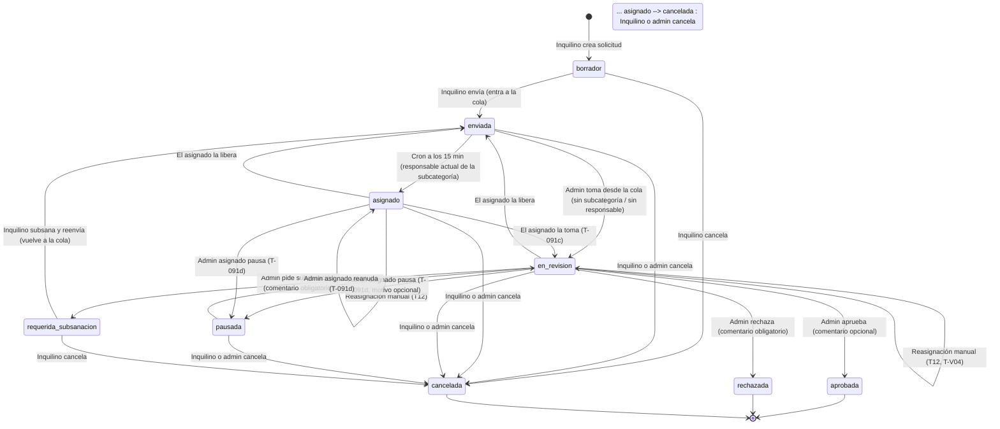
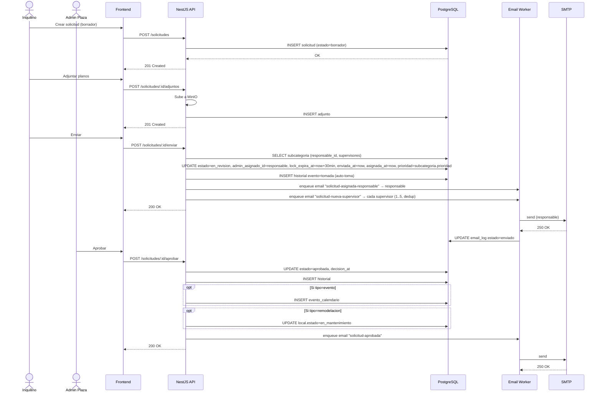
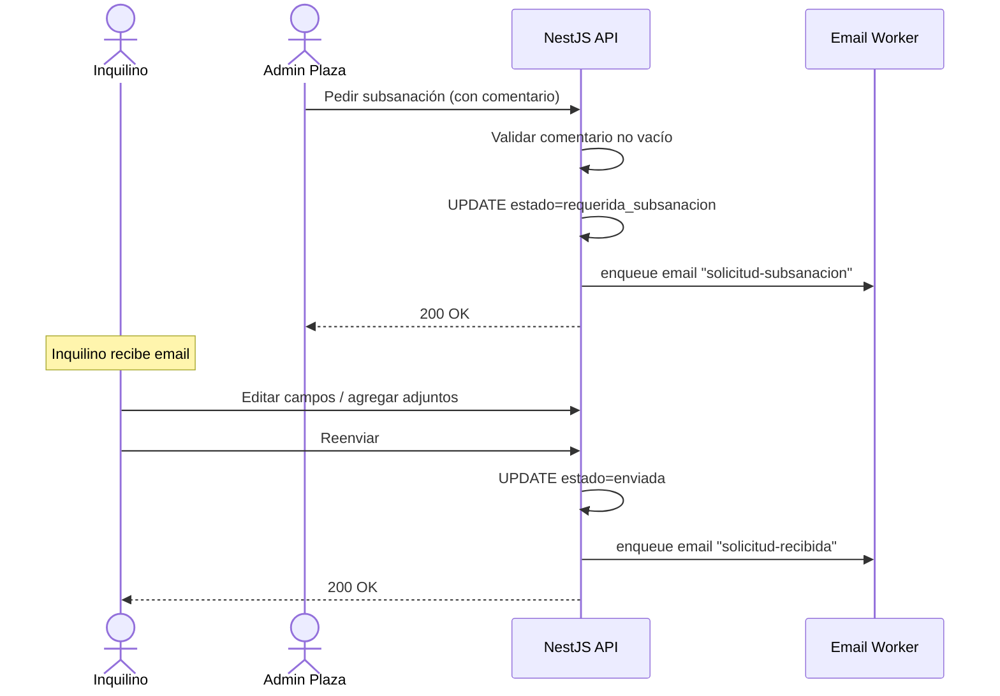

# 05 · Flujo de Solicitudes

> **Código del documento:** `DOC-05-FS`
> **Estado:** Revisado conforme a T-V03/T-V04/T-V05 (2026-06-06)
> **Eje principal del sistema.** Toda la lógica de negocio gira alrededor de este flujo.
>
> ⚠️ **Revisión T-V03 (vinculante, ver `PLANIFICACION/00-INDICE.md` §4):** el flujo
> incorpora el estado **`asignado`**, la espera de **15 minutos** antes de la
> auto-asignación y **ELIMINA el lock de 30 minutos**. T-V04 redefine la
> reasignación y T-V05 elimina la recurrencia de eventos en v1. Este documento
> refleja el flujo implementado en los módulos 06 y 07.

---

## 5.1. Visión general

Una **solicitud** es el objeto de negocio que conecta a un inquilino con la administración de la plaza. Recorre un ciclo de vida bien definido con estados explícitos, transiciones controladas, registro histórico inmutable y notificaciones automáticas.

Este documento define:

- Los **estados** posibles.
- Las **transiciones** válidas y quién las ejecuta.
- Las **notificaciones** disparadas en cada transición.
- Los **eventos** registrados en `solicitud_historial`.
- Los **casos especiales** (subsanación, cancelación, rechazo).

---

## 5.2. Estados posibles

| Estado | Descripción corta | Estado terminal |
|---|---|---|
| `borrador` | Creada por el inquilino, aún no enviada. | No |
| `enviada` | **En cola de asignación** (T-V03): el inquilino la envió y el sistema la auto-asignará a los 15 minutos. También es el estado al que vuelve una solicitud liberada o reenviada tras subsanación. | No |
| `asignado` | **(NUEVO, T-V03)** Auto-asignada al responsable de la subcategoría (o reasignada manualmente); el admin aún no empieza la revisión. Sin timeout: el asignado la "toma" cuando quiera. | No |
| `en_revision` | El admin asignado la tomó y la está revisando. | No |
| `requerida_subsanacion` | El admin pidió cambios al inquilino. | No |
| `pausada` | **(NUEVO, T-091d-pausar)** Congelada temporalmente por el admin asignado mientras espera algo externo (perito, proveedor, etc.). El SLA queda congelado y no aparece en KPIs `pendientes`. Reversible con `reanudar` (vuelve a `en_revision`). | **No** (reversible) |
| `aprobada` | Aprobada por el admin_plaza. | **Sí** |
| `rechazada` | Rechazada por el admin_plaza. | **Sí** |
| `cancelada` | Cancelada por el inquilino o por el admin. | **Sí** |

> **T-091d-pausar (introducido 2026-07-27):** el estado `pausada` se incorpora a v1 con semántica mínima (solo cambia `solicitud.estado`, sin emails, sin tocar calendario ni local). Detalle completo en `PLANIFICACION/14-pausar-solicitudes.md`. El SUPUESTO S-FS-I original (que excluía `pausada` y `en_ejecucion` de v1) se reemplaza por esta decisión. El estado `en_ejecucion` sigue fuera de v1.
>
> **S-AutoAsignacion (REVISADO en T-V03):** al enviar, la solicitud queda en `enviada` (cola). Un cron (cada 1 min) transiciona `enviada → asignado` cuando `enviada_at` supera los **15 minutos**, asignando al `responsable_id` ACTUAL de la subcategoría y notificando a responsable y supervisores. Las solicitudes sin subcategoría (tipo=`otro`) o cuya subcategoría no tiene responsable válido permanecen en `enviada` para toma manual desde la bandeja.

---

## 5.3. Diagrama de estados

> Cada transición **dispara** un email (ver §5.5) y **registra** un evento en `solicitud_historial` (ver §5.6).

---

## 5.4. Transiciones: detalle, actor y validaciones

| # | Transición | Actor | Validaciones | Efectos secundarios |
|---|---|---|---|---|
| T1 | `* → borrador` | Inquilino (creación) | `local_id` con contrato VIGENTE del inquilino; local no `fuera_de_servicio`; `categoria_id`/`subcategoria_id` presentes (salvo `tipo=otro`); subcategoría `activo=true`; `campos_extra` validados por tipo (Zod). | Historial `creada`; `prioridad` heredada de la subcategoría; `codigo` `SOL-{SLUG}-{seq}` por trigger. |
| **T2 (REVISADO T-V03)** | `borrador → enviada` | Inquilino | Título/descr. no vacíos; local no `fuera_de_servicio`; si hay subcategoría: activa y con responsable válido (SC-6). | `enviada_at = now()`. **NO asigna, NO crea lock, NO envía emails**: entra a la cola. Historial `enviada`. |
| **T2b (NUEVO, T-091b)** | `enviada → asignado` | Sistema (cron 1 min) | `enviada_at < now() - 15 min`; subcategoría activa con responsable que cumple SC-6 (si no, permanece en cola). | `admin_asignado_id = subcategoria.responsable_id` ACTUAL; `asignada_at = now()`; historial `asignada` (usuario NULL); email `solicitud-asignada-responsable` al responsable y `solicitud-nueva-supervisor` a cada supervisor (deduplicado). |
| **T2c (NUEVO, T-091c)** | `asignado → en_revision` | **Solo el admin asignado** (decisión confirmada) | Si otro admin intenta → `403 NOT_ASSIGNED_ADMIN` (debe reasignar primero). Desde `enviada` (cola sin asignar) cualquier `admin_plaza` puede tomar. | `asignada_at = now()`; historial `tomada`. |
| T3 | `borrador → cancelada` | Inquilino | Estado no terminal. | Historial `cancelada`; sin email. |
| T5 | `no terminal → cancelada` | Inquilino (las suyas) o Admin_plaza | Cualquier estado no terminal (`borrador`, `enviada`, `asignado`, `en_revision`, `requerida_subsanacion`). | Historial `cancelada` con motivo opcional; sin email. |
| T6 | `en_revision → aprobada` | Admin asignado | Comentario opcional; **SC-4: no es el creador** (`403 CANNOT_APPROVE_OWN_REQUEST`). | `decision_at = now()`; historial `aprobada`; email `solicitud-aprobada` al inquilino; si `tipo=evento` → upsert `evento_calendario`; si `tipo=remodelacion` → `local.estado = en_mantenimiento` con ventana `fecha_inicio/fin_mantenimiento` (cron diario la cierra). |
| T7 | `en_revision → rechazada` | Admin asignado | **Comentario obligatorio** (`400 COMENTARIO_REQUERIDO`); SC-4. | `decision_at = now()`; historial `rechazada`; email `solicitud-rechazada`. |
| T8 | `en_revision → requerida_subsanacion` | Admin asignado | **Comentario obligatorio**. Endpoint: `POST /solicitudes/:id/pedir-subsanacion`. | Historial `subsanada`; fila en `comentario` tipo `subsanacion`; `admin_asignado_id = NULL`; email `solicitud-subsanacion`. |
| **T9 (REVISADO T-V03)** | `requerida_subsanacion → enviada` | Inquilino | Endpoint: `POST /solicitudes/:id/subsanar`. Sin marcado de items (S-FS-E). | `enviada_at = now()`; `admin_asignado_id = NULL`; **vuelve a la COLA**: el cron re-asigna a los 15 min al responsable ACTUAL de la subcategoría. Historial `enviada`. |
| T10 | `requerida_subsanacion → cancelada` | Inquilino | — | Historial `cancelada`. |
| **T12 (REVISADO T-V04)** | `asignado\|en_revision → (mismo estado)` (reasignación) | Cualquier `admin_plaza` | `nuevo_responsable_id` cumple SC-6; mismo asignado → `400 SAME_ASSIGNEE`. **Sin lock que transferir** (T-V03). | `admin_asignado_id = nuevo`; `asignada_at = now()`; historial `reasignada` (estado se conserva); email `solicitud-reasignada` al nuevo. ⚠️ T-V04: cambiar el responsable de una subcategoría reasigna TODAS sus solicitudes en `asignado`/`en_revision`. |
| **T13 (NUEVO)** | `asignado\|en_revision → enviada` (liberar) | Solo el admin asignado | `403 NOT_ASSIGNED_ADMIN` si no. | `admin_asignado_id = NULL`; `enviada_at` NO se resetea (el SLA cuenta desde el envío original); vuelve a la cola del cron. |
| **T14 (NUEVO, T-091d-pausar)** | `asignado\|en_revision → pausada` (pausar) | Solo el admin asignado | `403 NOT_ASSIGNED_ADMIN` si no; motivo opcional. | `admin_asignado_id` y `asignada_at` se CONSERVAN; historial `pausada` con motivo opcional; SLA congelado (matview `solicitud_sla_view` excluye el estado); sin email (silencioso). |
| **T15 (NUEVO, T-091d-pausar)** | `pausada → en_revision` (reanudar) | Solo el admin asignado | `403 NOT_ASSIGNED_ADMIN` si no. | `admin_asignado_id` y `asignada_at` se conservan (sin reset); historial `reanudada`; SLA retoma el conteo desde el envío original; sin email. |
| T11 | Reversión (caso excepcional) | Superadmin (no UI) | Solo mediante intervención directa en BD. | Registrado en `auditoria`. **No se documenta como flujo de UI.** |

> **S-LockTimeout (ELIMINADO en T-V03):** el lock de 30 minutos NO existe. Lo que existe es la espera de 15 minutos en `enviada` antes de la auto-asignación (T2b). Una vez en `asignado` no hay timeout: el asignado toma cuando quiera, otro admin puede reasignar (T12) y el asignado puede liberar (T13).

---

## 5.5. Notificaciones disparadas

| Transición | Plantilla | Destinatario | Cuándo se envía |
|---|---|---|---|
| **T2b (`enviada → asignado`, cron)** | `solicitud-asignada-responsable` | Responsable de la subcategoría. | Se ENCOLA en `email_log` (estado `pendiente`); el worker del módulo 09 envía. |
| **T2b (mismo evento, 1 email por supervisor)** | `solicitud-nueva-supervisor` | Cada supervisor de la subcategoría (0..5). Deduplicado si coincide con el responsable. | Encolado. |
| T6 (`→ aprobada`) | `solicitud-aprobada` | Usuario creador (inquilino). | Encolado. |
| T7 (`→ rechazada`) | `solicitud-rechazada` | Usuario creador. | Encolado. |
| T8 (`→ requerida_subsanacion`) | `solicitud-subsanacion` | Usuario creador. | Encolado. |
| T9 (reenvío) | — (sin email inmediato) | El email llega con la re-asignación del cron (T2b). | — |
| **T12 (reasignación manual o por cambio de responsable)** | `solicitud-reasignada` | Nuevo responsable. | Encolado. |
| T2/T3/T5/T13/T14/T15 (enviar, cancelar, liberar, pausar, reanudar) | — | Sin email (T-V03: enviar no notifica; cancelación silenciosa; pausa y reanudación también silenciosas en v1). | — |

**Todas las notificaciones se registran en `email_log`** con `estado`, `reintentos`, `last_error` y se procesan por el worker con reintentos exponenciales.

---

## 5.6. Eventos registrados en `solicitud_historial`

Por cada transición, se inserta una fila con:

| Campo | Valor |
|---|---|
| `solicitud_id` | El id de la solicitud. |
| `usuario_id` | El usuario que causó el evento. |
| `evento` | Uno de: `creada`, `enviada`, `tomada`, `aprobada`, `rechazada`, `subsanada`, `cancelada`, `comentario`, `adjunto_agregado`, `pausada`, `reanudada`. |
| `estado_anterior` | El estado antes. |
| `estado_nuevo` | El estado después (NULL para `comentario` y `adjunto_agregado`). |
| `comentario` | El comentario asociado, si aplica. |
| `created_at` | Timestamp del evento. |

> **Inmutabilidad:** ninguna fila de `solicitud_historial` se actualiza ni se borra. Es la fuente de verdad de auditoría del flujo.

---

## 5.7. Diagramas de secuencia

### 5.7.1. Flujo feliz (aprobación)

### 5.7.2. Flujo de subsanación

---

## 5.8. Cola de asignación (REVISADO T-V03 — sin lock)

El "lock de 30 minutos" del diseño original se **eliminó** (T-V03). La defensa
anti-doble-revisión es estructural:

- Una solicitud `asignado`/`en_revision` tiene UN `admin_asignado_id`; solo él
  puede tomarla, aprobarla, rechazarla o pedir subsanación (`403
  NOT_ASSIGNED_ADMIN` para el resto).
- Otro admin que quiera trabajarla debe **reasignarla** primero (T12) — la
  reasignación es explícita y queda en el historial.
- El asignado puede **liberar** (T13): la solicitud vuelve a `enviada` (cola) y
  el cron la re-asignará al responsable actual de la subcategoría (a los 15 min
  desde su `enviada_at` original, es decir, normalmente en el siguiente tick).
- Cron de auto-asignación (`*/1 min`): `enviada` con `enviada_at < now() - 15
  min` → `asignado`. Idempotente; deja en cola lo que no tiene responsable
  válido y lo loguea como warning.

## 5.9. SLA visual (semáforo)

**S-SLA (confirmado en T-V03).** Por configuración de la plaza (`configuracion.sla_dias_por_tipo`), cada tipo de solicitud tiene un número máximo de días desde `enviada_at` hasta `decision_at`. **El timer corre desde `enviada_at`** (no desde la asignación ni la toma); si el SLA vence mientras está en la cola, se muestra rojo.

**S-SLA-Prioridad (confirmado).** Multiplicador por prioridad en `configuracion.sla_multiplicador_por_prioridad` (JSONB). **Defaults (T-V03): `{"A": 0.5, "B": 1.0, "C": 1.5, "D": 2.0, "F": 3.0}`.** SLA efectivo = `sla_dias_por_tipo[tipo] * multiplicador_por_prioridad[prioridad]`.

| Tiempo transcurrido | Color | Acción |
|---|---|---|
| `< 50%` del SLA efectivo | Verde | Sin resaltado. |
| `50% – 100%` | Amarillo | Resaltado en la bandeja. |
| `> 100%` | Rojo | Resaltado + email opcional al superadmin. |

El SLA se precalcula en la vista materializada `solicitud_sla_view`, refrescada por cron diario (02:00 América/El_Salvador, `REFRESH CONCURRENTLY`); la bandeja la consulta y calcula al vuelo las filas aún no materializadas.

---

## 5.10. Casos especiales

### 5.10.1. Solicitudes duplicadas

- **Regla:** no hay bloqueo duro; se permiten duplicados porque dos solicitudes similares pueden ser legítimas (p. ej. dos remodelaciones en la misma zona).
- **Heurística de ayuda (SUPUESTO):** al crear una solicitud, el backend busca solicitudes del mismo `local_id` y mismo `tipo` en los últimos 30 días y muestra un aviso "ya existe una solicitud similar: SOL-XXX". No bloquea.

### 5.10.2. Cambios de local durante el flujo

- Mientras la solicitud esté en `borrador` o `requerida_subsanacion`, el inquilino puede cambiar el `local_id`.
- A partir de `enviada`, no se puede cambiar el local. Si se requiere, se cancela y se crea nueva.

### 5.10.3. Baja del local durante el flujo

- Si el `local` pasa a `fuera_de_servicio` mientras la solicitud está `enviada` o `en_revision`, el admin debe rechazarla con motivo "local fuera de servicio".

### 5.10.4. Desactivación del usuario solicitante

- Si el `inquilino` o su `usuario` se desactiva, sus solicitudes en `borrador` quedan ocultas al admin (SUPUESTO).
- Las solicitudes ya enviadas siguen visibles para el admin para decisión.

### 5.10.5. Solicitudes con muchos adjuntos

- Límite duro: 10 adjuntos por solicitud. (SUPUESTO — confirmar.)
- Límite duro: 25 MB por adjunto (ver §2.7).

---

## 5.11. Métricas del flujo (alimentan el panel admin)

| Métrica | Cálculo |
|---|---|
| **Solicitudes pendientes** | `COUNT` donde `estado IN ('enviada','en_revision','requerida_subsanacion')`. **`pausada` NO cuenta como pendiente`** (T-091d-pausar). |
| **Tasa de aprobación** | `aprobadas / (aprobadas + rechazadas)` en el período. |
| **Tiempo medio de respuesta** | `AVG(decision_at - enviada_at)` filtrado por estados terminales. |
| **Solicitudes con subsanación** | `COUNT` donde hubo paso por `requerida_subsanacion`. |
| **Eventos próximos (7 días)** | `COUNT` en `evento_calendario` con `inicio BETWEEN now AND now+7d`. |
| **Top 5 por antigüedad** | `ORDER BY enviada_at ASC LIMIT 5 WHERE estado IN ('enviada','en_revision')`. **`pausada` NO se incluye** (T-091d-pausar). |

---

## 5.12. Resumen de SUPUESTOS del flujo

| ID | Supuesto |
|---|---|
| S-FS-A | Estados terminales: `aprobada`, `rechazada`, `cancelada`. |
| S-FS-B | Reversión solo por superadmin vía BD; sin UI. |
| S-FS-C | ~~Lock de revisión de 30 min~~ **ELIMINADO (T-V03)**: espera de 15 min en cola + asignación sin timeout. |
| S-FS-D | SLA visual por tipo, configurable por plaza. |
| S-FS-E | Subsanación no exige marcado de items atendidos. |
| S-FS-F | Cambio de local permitido solo en `borrador` y `requerida_subsanacion`. |
| S-FS-G | 10 adjuntos máximo por solicitud. |
| S-FS-H | No se bloquean duplicados; se avisa. |
| S-FS-I | **REVISADO (2026-07-27, T-091d-pausar):** estado `pausada` introducido en v1 con semántica mínima (ver T14/T15). Estado `en_ejecucion` sigue excluido de v1. |
| S-FS-AutoAsignacion | **REVISADO (T-V03):** al enviar queda en cola (`enviada`); el cron asigna a los 15 min al responsable ACTUAL de la subcategoría y notifica a responsable + supervisores. |
| S-FS-Prioridad | La `prioridad ∈ {A,B,C,D,F}` se hereda de la subcategoría al crear; modificable por `admin_plaza` con `PATCH /solicitudes/:id`. |
| S-FS-Supervisores | Una subcategoría puede tener entre 0 y 5 supervisores (enforced por trigger PG `tg_subcategoria_max_5_supervisores`). |
| S-FS-Reasignacion | **REVISADO (T-V04):** cualquier `admin_plaza` reasigna en `asignado`/`en_revision` (sin lock). Cambiar el responsable de una subcategoría reasigna TODAS sus solicitudes activas. |
