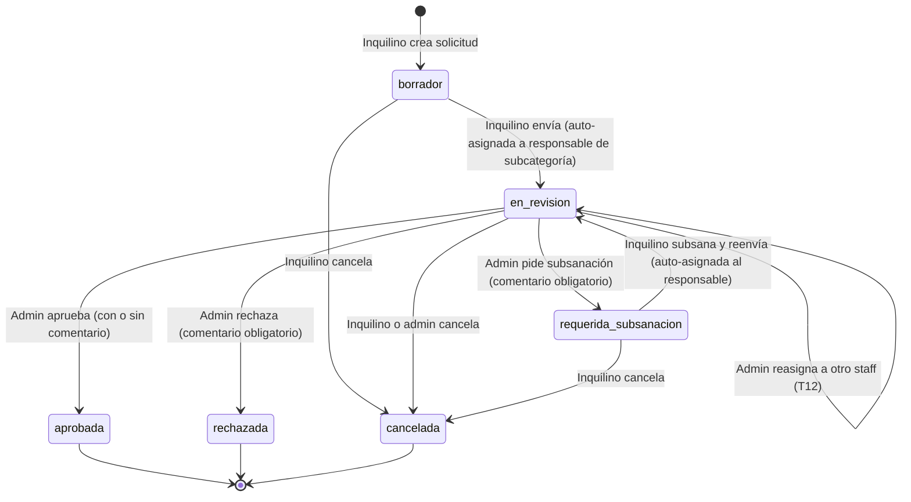
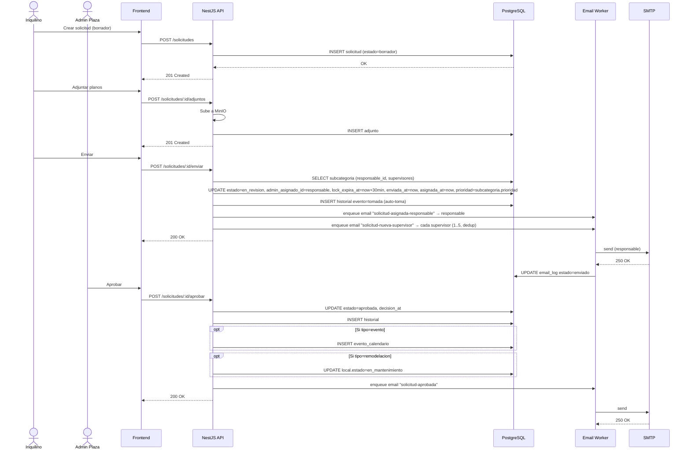
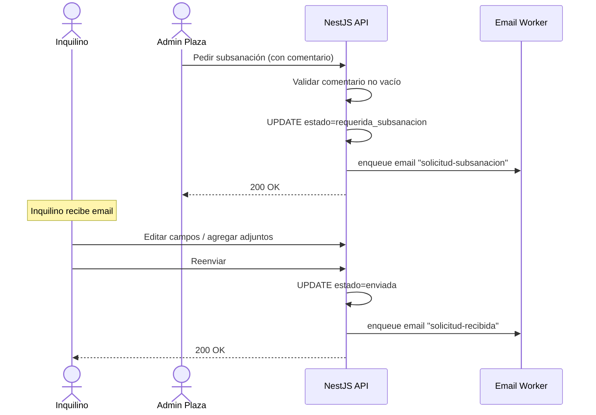

# 05 · Flujo de Solicitudes

> **Código del documento:** `DOC-05-FS`
> **Estado:** Borrador para validación
> **Eje principal del sistema.** Toda la lógica de negocio gira alrededor de este flujo.

---

## 5.1. Visión general

Una **solicitud** es el objeto de negocio que conecta a un inquilino con la administración de la plaza. Recorre un ciclo de vida bien definido con estados explícitos, transiciones controladas, registro histórico inmutable y notificaciones automáticas.

Este documento define:

- Los **estados** posibles.
- Las **transiciones** válidas y quién las ejecuta.
- Las **notificaciones** disparadas en cada transición.
- Los **eventos** registrados en `solicitud_historial`.
- Los **casos especiales** (subsanación, cancelación, rechazo).

---

## 5.2. Estados posibles

| Estado | Descripción corta | Estado terminal |
|---|---|---|
| `borrador` | Creada por el inquilino, aún no enviada. | No |
| `enviada` | **Estado de transición tras reasignación**: cuando se libera un lock y la solicitud queda sin responsable, queda brevemente en `enviada` mientras el sistema la re-asigna. No es estado inicial del flujo nuevo. | No |
| `en_revision` | Un admin_plaza la está revisando (auto-asignada al responsable de la subcategoría al enviar, o reasignada manualmente). | No |
| `requerida_subsanacion` | El admin pidió cambios al inquilino. | No |
| `aprobada` | Aprobada por el admin_plaza. | **Sí** |
| `rechazada` | Rechazada por el admin_plaza. | **Sí** |
| `cancelada` | Cancelada por el inquilino o por el admin. | **Sí** |

> **SUPUESTO:** el cliente puede requerir un estado `pausada` o `en_ejecucion` para distinguir entre "aprobada" y "ya ejecutada". Esto se aborda en una posible v1.1.
>
> **SUPUESTO S-AutoAsignacion:** con la auto-asignación, una solicitud **nueva** con `subcategoria_id` transita `borrador → en_revision` directamente, sin pasar por `enviada`. El estado `enviada` se conserva en el modelo para representar el caso de reasignación manual (T12) cuando el sistema aún no ha elegido nuevo responsable.

---

## 5.3. Diagrama de estados

> Cada transición **dispara** un email (ver §5.5) y **registra** un evento en `solicitud_historial` (ver §5.6).

---

## 5.4. Transiciones: detalle, actor y validaciones

| # | Transición | Actor | Validaciones | Efectos secundarios |
|---|---|---|---|---|
| T1 | `* → borrador` | Inquilino (creación) | `local_id` pertenece a un local del inquilino; el local no está `fuera_de_servicio`; `categoria_id` y `subcategoria_id` presentes (salvo `tipo=otro` con `categoria_libre`); la subcategoría está `activo=true`. | Inserta `solicitud_historial.evento=creada`; `prioridad` se setea con la default de la subcategoría (heredada). |
| **T2 (nuevo)** | `borrador → en_revision` | Inquilino | Título y descripción no vacíos; al menos 1 adjunto si la plaza lo exige (SUPUESTO); `subcategoria.responsable_id` debe ser un `admin_plaza` activo con `rol_staff` activo. | `enviada_at = now()`; `admin_asignado_id = subcategoria.responsable_id`; `asignada_at = now()`; `lock_expira_at = now() + 30 min`; inserta historial `tomada` (auto-toma); email `solicitud-asignada-responsable.html` al responsable; un email `solicitud-nueva-supervisor.html` por cada supervisor (1..5) de la subcategoría, deduplicado si el mismo usuario es responsable. |
| T3 | `borrador → cancelada` | Inquilino | La solicitud está en `borrador`. | Inserta historial `cancelada`; sin email. |
| T5 | `en_revision → cancelada` | Inquilino o Admin_plaza | La solicitud está en `en_revision`. | Inserta historial `cancelada`; libera el lock. |
| T6 | `en_revision → aprobada` | Admin_plaza | Comentario opcional; **no es admin que creó la solicitud** (defense in depth). | `decision_at = now()`; inserta historial `aprobada`; email al inquilino; si tipo=`evento`, crea `evento_calendario`; si tipo=`remodelacion`, marca `local.estado = en_mantenimiento` durante el rango. |
| T7 | `en_revision → rechazada` | Admin_plaza | **Comentario obligatorio no vacío**. | `decision_at = now()`; inserta historial `rechazada`; email al inquilino. |
| T8 | `en_revision → requerida_subsanacion` | Admin_plaza | **Comentario obligatorio no vacío**. | Inserta historial `requerida_subsanacion`; email al inquilino. |
| T9 | `requerida_subsanacion → en_revision` | Inquilino | Comentarios del admin atendidos (SUPUESTO: no se exige marcado manual de items); la solicitud se re-envía re-autoasignándose al **mismo responsable** que la tenía antes (o al `subcategoria.responsable_id` actual si la subcategoría cambió de responsable mientras tanto). | `enviada_at = now()`; `asignada_at = now()`; `lock_expira_at = now() + 30 min`; inserta historial `enviada`; email al responsable (re-asignación). |
| T10 | `requerida_subsanacion → cancelada` | Inquilino | — | Inserta historial `cancelada`. |
| **T12 (nuevo)** | `en_revision → en_revision` (reasignación) | Admin_plaza | Cualquier `admin_plaza` (SUPUESTO S-Reasignacion); `nuevo_responsable_id` debe ser un `admin_plaza` con `rol_staff` activo y misma plaza. Opcional: `comentario` para registrar motivo. | Libera el lock anterior; `admin_asignado_id = nuevo_responsable_id`; `asignada_at = now()`; `lock_expira_at = now() + 30 min`; inserta historial `reasignada` con `estado_anterior = en_revision`, `estado_nuevo = en_revision`, y `comentario` con el motivo; email `solicitud-reasignada.html` al nuevo responsable. |
| T11 | Reversión (caso excepcional) | Superadmin (no UI) | Solo mediante intervención directa en BD. | Registrado en `auditoria`. **No se documenta como flujo de UI.** |

> **SUPUESTO S-LockTimeout:** el lock de revisión dura 30 minutos desde la última asignación (T2 o T12). Al expirar, la solicitud vuelve al estado `enviada` y queda disponible para que cualquier `admin_plaza` la tome manualmente (T4 legacy) o el sistema la reasigne (futuro, S-Repick). En la v1 se reasigna manualmente.

---

## 5.5. Notificaciones disparadas

| Transición | Plantilla | Destinatario | Cuándo se envía |
|---|---|---|---|
| **T2 (`borrador → en_revision`)** | `solicitud-asignada-responsable.html` | Responsable de la subcategoría (`subcategoria.responsable_id`). | Inmediato (worker cada 1 min). |
| **T2 (mismo evento, 1 email por supervisor)** | `solicitud-nueva-supervisor.html` | Cada uno de los hasta 5 supervisores de la subcategoría. Deduplicado si coincide con el responsable. | Inmediato. |
| T4 legacy (`enviada → en_revision`, tras lock expirado) | `solicitud-recibida.html` | `admin_asignado_id` (admin que tomó) o todos los `admin_plaza` activos de la plaza. | Inmediato. |
| T6 (`→ aprobada`) | `solicitud-aprobada.html` | Inquilino solicitante | Inmediato. |
| T7 (`→ rechazada`) | `solicitud-rechazada.html` | Inquilino solicitante | Inmediato. |
| T8 (`→ requerida_subsanacion`) | `solicitud-subsanacion.html` | Inquilino solicitante | Inmediato. |
| T9 (`requerida_subsanacion → en_revision`) | `solicitud-recibida.html` o `solicitud-asignada-responsable.html` | `admin_asignado_id` (re-asignado al mismo responsable o al nuevo si cambió la subcategoría). | Inmediato. |
| **T12 (reasignación manual)** | `solicitud-reasignada.html` | Nuevo responsable. | Inmediato. |

**Todas las notificaciones se registran en `email_log`** con `estado`, `reintentos`, `last_error` y se procesan por el worker con reintentos exponenciales.

---

## 5.6. Eventos registrados en `solicitud_historial`

Por cada transición, se inserta una fila con:

| Campo | Valor |
|---|---|
| `solicitud_id` | El id de la solicitud. |
| `usuario_id` | El usuario que causó el evento. |
| `evento` | Uno de: `creada`, `enviada`, `tomada`, `aprobada`, `rechazada`, `subsanada`, `cancelada`, `comentario`, `adjunto_agregado`. |
| `estado_anterior` | El estado antes. |
| `estado_nuevo` | El estado después (NULL para `comentario` y `adjunto_agregado`). |
| `comentario` | El comentario asociado, si aplica. |
| `created_at` | Timestamp del evento. |

> **Inmutabilidad:** ninguna fila de `solicitud_historial` se actualiza ni se borra. Es la fuente de verdad de auditoría del flujo.

---

## 5.7. Diagramas de secuencia

### 5.7.1. Flujo feliz (aprobación)

### 5.7.2. Flujo de subsanación

---

## 5.8. Locking de revisión (defensa anti-doble)

Para evitar que dos admins trabajen la misma solicitud a la vez:

- Al enviar la solicitud (T2) **o** al reasignar (T12), se setea `admin_asignado_id` y se registra `lock_expira_at = now() + 30 min` (SUPUESTO S-LockTimeout) en una tabla ligera o en `solicitud` mismo.
- Cualquier intento de reasignar (T12) o de tomar la solicitud cuando hay un lock vigente y pertenece a otro admin recibe `409 Conflict`.
- El lock se libera al:
  - Aprobar, rechazar o pedir subsanación.
  - Cancelar.
  - Reasignar (T12) — el lock se transfiere al nuevo responsable con 30 min frescos.
  - Expirar los 30 min — la solicitud vuelve a `enviada` y queda disponible para `tomar` o reasignar manualmente.
- Si un admin quiere "liberar" el lock manualmente, hay un endpoint `POST /solicitudes/:id/liberar` (SUPUESTO) que requiere rol `admin_plaza`; al liberar, la solicitud queda en `enviada` y el sistema intentará re-autoasignar a un responsable.

---

## 5.9. SLA visual (semáforo)

**SUPUESTO S-SLA.** Por configuración de la plaza (`configuracion.sla_dias_por_tipo`), cada tipo de solicitud tiene un número máximo de días desde `enviada_at` hasta `decision_at`.

**SUPUESTO S-SLA-Prioridad.** El `admin_plaza` puede configurar un **multiplicador de SLA por prioridad** en `configuracion.sla_multiplicador_por_prioridad` (JSONB, p. ej. `{"A": 0.5, "B": 1.0, "C": 1.0, "D": 1.5, "F": 2.0}`). El SLA efectivo se calcula como `sla_dias_por_tipo[tipo] * multiplicador_por_prioridad[prioridad]`.

| Tiempo transcurrido | Color | Acción |
|---|---|---|
| `< 50%` del SLA efectivo | Verde | Sin resaltado. |
| `50% – 100%` | Amarillo | Resaltado en la bandeja. |
| `> 100%` | Rojo | Resaltado + email opcional al superadmin. |

El SLA se calcula con un cron diario que actualiza una vista materializada `solicitud_sla_view` (SUPUESTO).

---

## 5.10. Casos especiales

### 5.10.1. Solicitudes duplicadas

- **Regla:** no hay bloqueo duro; se permiten duplicados porque dos solicitudes similares pueden ser legítimas (p. ej. dos remodelaciones en la misma zona).
- **Heurística de ayuda (SUPUESTO):** al crear una solicitud, el backend busca solicitudes del mismo `local_id` y mismo `tipo` en los últimos 30 días y muestra un aviso "ya existe una solicitud similar: SOL-XXX". No bloquea.

### 5.10.2. Cambios de local durante el flujo

- Mientras la solicitud esté en `borrador` o `requerida_subsanacion`, el inquilino puede cambiar el `local_id`.
- A partir de `enviada`, no se puede cambiar el local. Si se requiere, se cancela y se crea nueva.

### 5.10.3. Baja del local durante el flujo

- Si el `local` pasa a `fuera_de_servicio` mientras la solicitud está `enviada` o `en_revision`, el admin debe rechazarla con motivo "local fuera de servicio".

### 5.10.4. Desactivación del usuario solicitante

- Si el `inquilino` o su `usuario` se desactiva, sus solicitudes en `borrador` quedan ocultas al admin (SUPUESTO).
- Las solicitudes ya enviadas siguen visibles para el admin para decisión.

### 5.10.5. Solicitudes con muchos adjuntos

- Límite duro: 10 adjuntos por solicitud. (SUPUESTO — confirmar.)
- Límite duro: 25 MB por adjunto (ver §2.7).

---

## 5.11. Métricas del flujo (alimentan el panel admin)

| Métrica | Cálculo |
|---|---|
| **Solicitudes pendientes** | `COUNT` donde `estado IN ('enviada','en_revision','requerida_subsanacion')`. |
| **Tasa de aprobación** | `aprobadas / (aprobadas + rechazadas)` en el período. |
| **Tiempo medio de respuesta** | `AVG(decision_at - enviada_at)` filtrado por estados terminales. |
| **Solicitudes con subsanación** | `COUNT` donde hubo paso por `requerida_subsanacion`. |
| **Eventos próximos (7 días)** | `COUNT` en `evento_calendario` con `inicio BETWEEN now AND now+7d`. |
| **Top 5 por antigüedad** | `ORDER BY enviada_at ASC LIMIT 5 WHERE estado IN ('enviada','en_revision')`. |

---

## 5.12. Resumen de SUPUESTOS del flujo

| ID | Supuesto |
|---|---|
| S-FS-A | Estados terminales: `aprobada`, `rechazada`, `cancelada`. |
| S-FS-B | Reversión solo por superadmin vía BD; sin UI. |
| S-FS-C | Lock de revisión de 30 min. |
| S-FS-D | SLA visual por tipo, configurable por plaza. |
| S-FS-E | Subsanación no exige marcado de items atendidos. |
| S-FS-F | Cambio de local permitido solo en `borrador` y `requerida_subsanacion`. |
| S-FS-G | 10 adjuntos máximo por solicitud. |
| S-FS-H | No se bloquean duplicados; se avisa. |
| S-FS-I | Estados `pausada` y `en_ejecucion` no se contemplan en v1. |
| S-FS-AutoAsignacion | Al enviar una solicitud, se asigna automáticamente al responsable de la subcategoría con lock 30 min; los supervisores de la subcategoría son notificados. |
| S-FS-Prioridad | La `prioridad ∈ {A,B,C,D,F}` se hereda de la subcategoría al crear; modificable por `admin_plaza` con `PATCH /solicitudes/:id`. |
| S-FS-Supervisores | Una subcategoría puede tener entre 0 y 5 supervisores (enforced por trigger PG `tg_subcategoria_max_5_supervisores`). |
| S-FS-Reasignacion | Cualquier `admin_plaza` puede reasignar manualmente (T12) una solicitud a otro staff; el lock se transfiere con 30 min frescos. |
